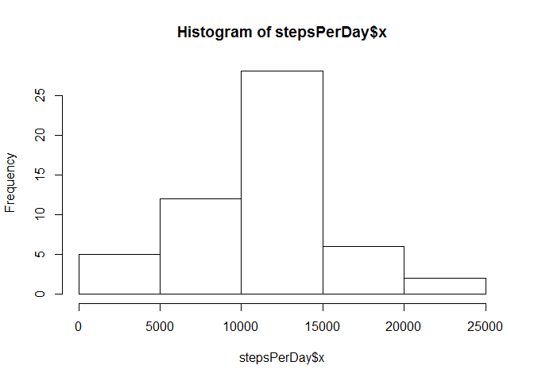
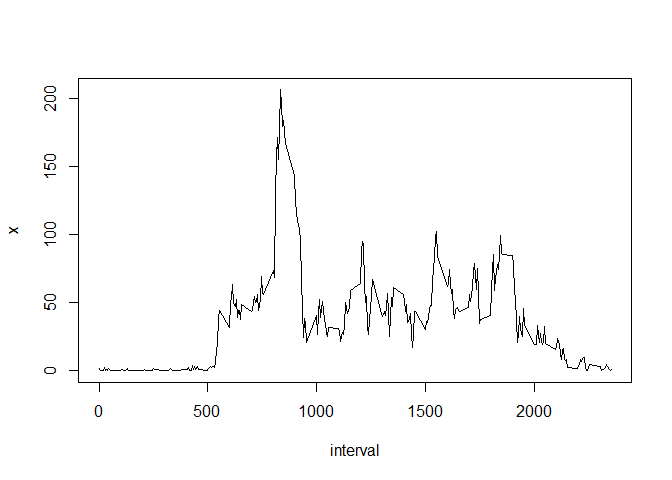
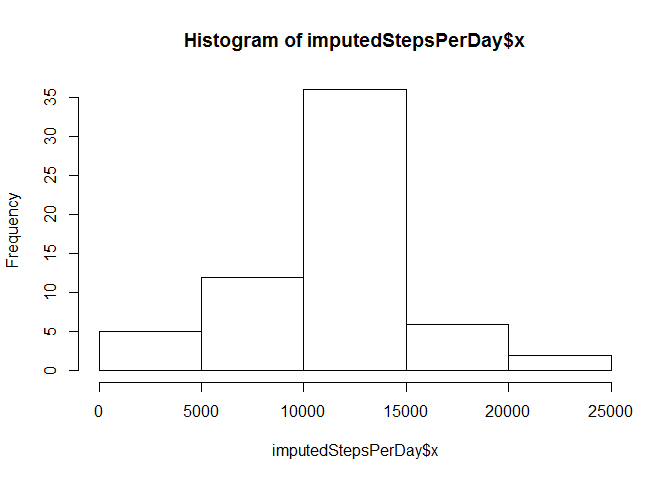
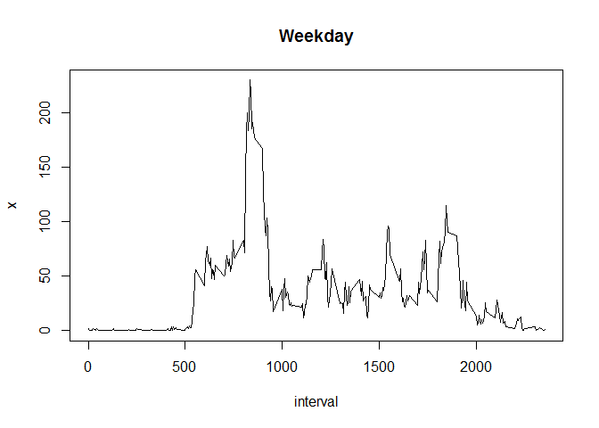
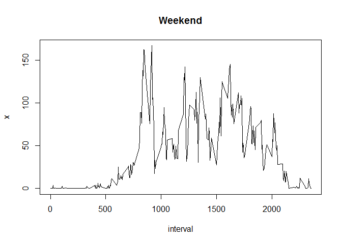

# Reproducible Research: Peer Assessment 1


## Loading and preprocessing the data
The following code reads the data from the 'activity.csv' file into an 'activityData' data frame. The code must be executed in the same directory as the 'activity.csv' file. The code reads character data as strings and not as factors.


```r
activityData <- read.csv("activity.csv",stringsAsFactors=FALSE)
activityData$date <- as.Date(activityData$date)
```


## What is mean total number of steps taken per day?

```r
stepsPerDay <- aggregate(activityData$steps, by=list(date=activityData$date),FUN=sum)
meanStepsPerDay <- mean(stepsPerDay$x,na.rm=TRUE)
medianStepsPerDay <- median(stepsPerDay$x,na.rm=TRUE)

hist(stepsPerDay$x)
```

 

Missing data was ignored in the prior calculations
The mean number of steps per day is 1.0766189\times 10^{4}. 
The median number of steps per day is 10765.


## What is the average daily activity pattern?

```r
intervalAvg <- aggregate(activityData$steps, by=list(interval=activityData$interval),FUN=mean,na.rm=TRUE)
maxIntervalAvg <- intervalAvg[which(intervalAvg$x == max(intervalAvg$x,na.rm=TRUE)),]
plot(intervalAvg,type="l")
```

 

The interval with the maximum average number of steps is interval 835.


## Imputing missing values

```r
naRows <- sum(is.na(activityData$steps))
activityDataImputed <- activityData
for (i in 1:nrow(activityDataImputed)){
      adInterval <- activityDataImputed[i,"interval"]
      ivAvg <- intervalAvg[intervalAvg$interval == adInterval,"x"]
      if (is.na(activityDataImputed[i,"steps"])){
            activityDataImputed[i,"steps"] <- ivAvg
      }
}
imputedStepsPerDay <- aggregate(activityDataImputed$steps, by=list(date=activityDataImputed$date),FUN=sum)
imputedMeanStepsPerDay <- mean(imputedStepsPerDay$x,na.rm=TRUE)
imputedMedianStepsPerDay <- median(imputedStepsPerDay$x,na.rm=TRUE)

hist(imputedStepsPerDay$x)
```

 

There are 2304 rows with NA values. Missing data was substituted with the mean values of each specific 5 minute interval.

The mean number of steps per day with imputed data subsituting for missing values is 1.0766189\times 10^{4}. The median number of steps per day with imputed data substituting for missing values is also 1.0766189\times 10^{4}.

Imputing the missing data in this fashion causes a denser cluster of values around the original mean.

## Are there differences in activity patterns between weekdays and weekends?


```r
weekdays1 <- c('Monday','Tuesday','Wednesday','Thursday','Friday')
activityDataImputed$dayType <- factor((weekdays(activityDataImputed$date) %in% weekdays1)+1L,levels=1:2, labels=c('weekend', 'weekday'))

weekendData <- subset(activityDataImputed, dayType == "weekend", select=c("interval","steps")) 
weekdayData <- subset(activityDataImputed, dayType == "weekday", select=c("interval","steps")) 

stepsPerWeekday <- aggregate(weekdayData$steps, by=list(interval=weekdayData$interval),FUN=mean)
stepsPerWeekendDay <- aggregate(weekendData$steps, by=list(interval=weekendData$interval),FUN=mean)

par(mfrow=c(2,1))
x11(height=6)
plot(stepsPerWeekday,type="l",main="Weekday")
```

 

```r
plot(stepsPerWeekendDay,type="l",main="Weekend")
```

 

As shown by the graphs, the average number of steps per day peaks at a higher number on weekdays than on weekends. Conversely, the average number of steps taken per interval shows a more prolonged rate of activity on weekends.


